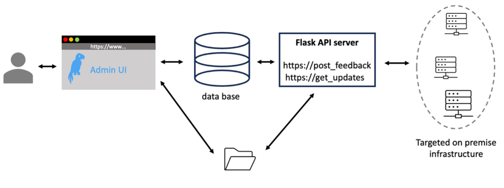
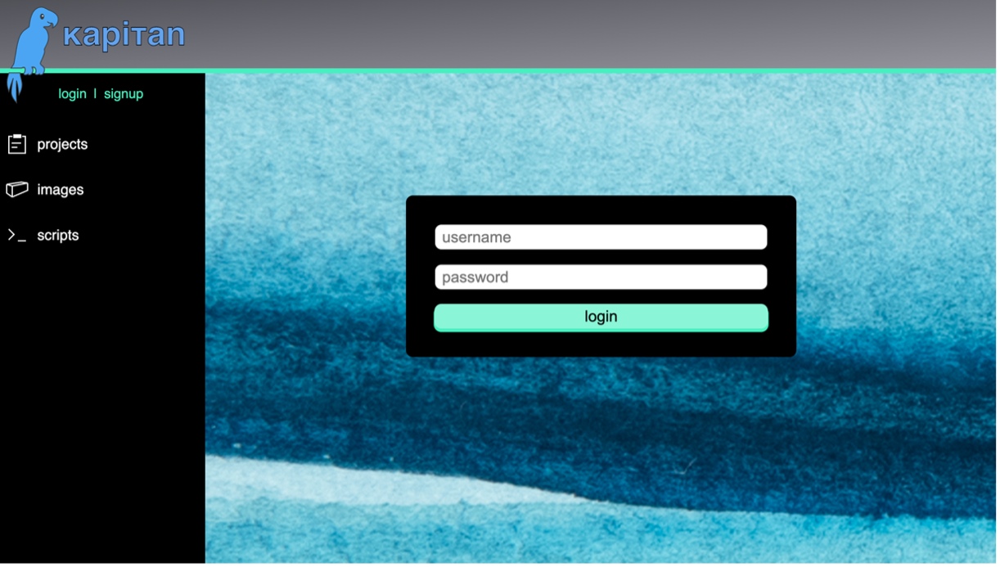
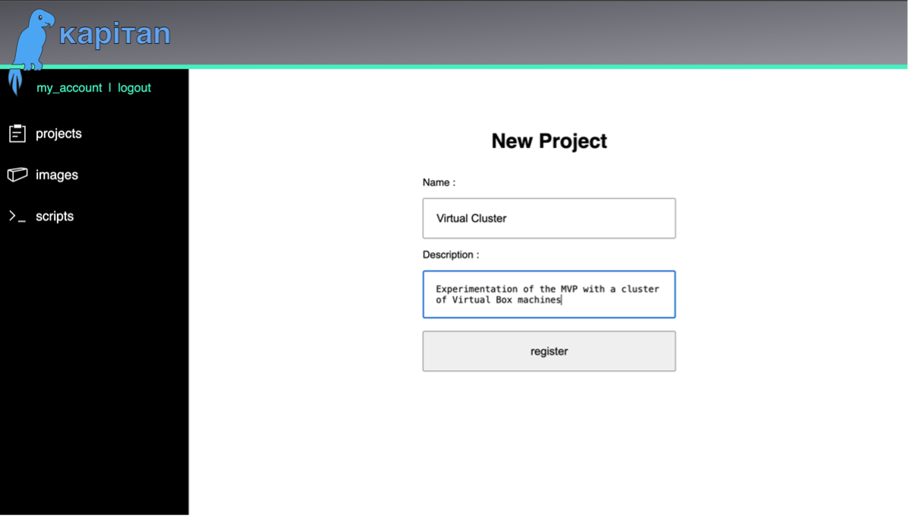
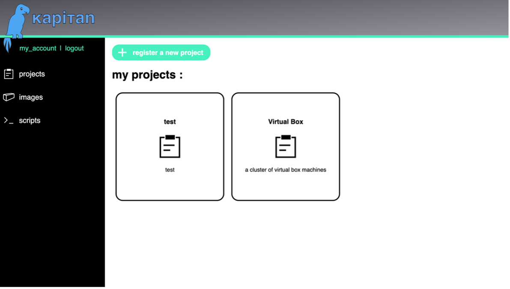
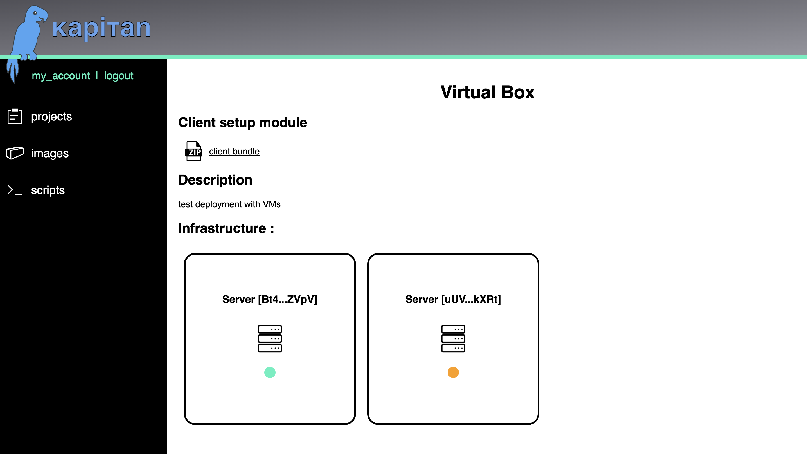
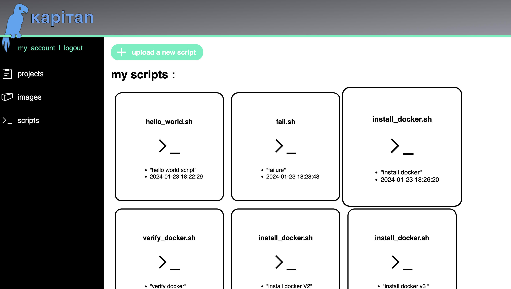
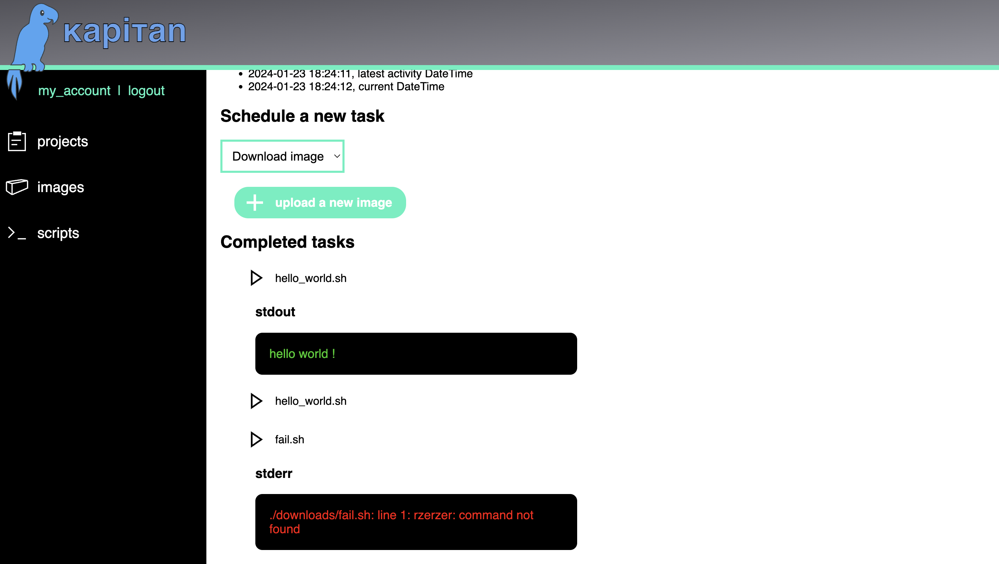
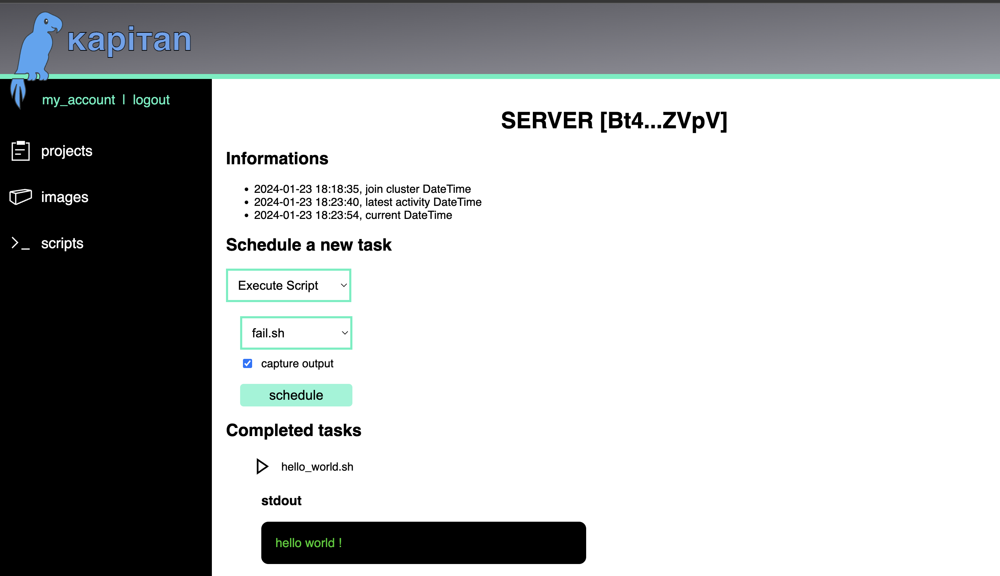

<h1 style="text-align:center">
    Kapitan, <br/>
    "Deployement and Supervision as a Service" 
</h1>


## Introduction

Kapitan is an alternative to DevOps services like `Portainer.io Business Edition` or `Porter.run` or `Rancher.com`. It was done as the MVP for my EPFL IC Bachelor project under the supervision of Professor Edouard BUGNION. Kapitan is a proof of concept to solve deployment challenges faced by StackSync.cloud compagny (SaaS) with clients requiring onpremise deployement.
 
Kapitan enables to deploy, manage and update containerized micro-architecture software system on linux on-premise architecture with ease. 

Kapitan provides a software system to create and manage multiple deployment projects on one centralized web user interface. 

Once a project is created, a lightweight installation bundle uniquelly referencing a project is created and can be forwarded to clients. Clients can run the setup bundle on their linux machines in order to register an onpremise infrastructure. It is recommanded to be provided with a dedicated infrastructure running only the intended software system : this can be achieve by creating VM on the client side. For resiliance the machines might be distinct physical machines. 

When the client is registered on the client infrastructure, a periodic communication takes place between the clients servers and the admin server. 

The admin server, accepts the upload of files, in order to be forwared to the clients. 

## Functionnalities 

For the moment the plateform enables to do the following 
- signup
- login & logout 
- upload scripts
- upload docker images and other files
- create projects
- download the zip client bundle for a given project containing
- - the script to be registered as a service on the host device
- - the unique project token for authentification 
- - the certificate of the server for certificate comparison
- accept the registry of machines via https querries 
- schedule the execution of a script on a client Machine 
- visualize the result of the execution of a script 

Disclaimer : <br/>
<strong>
    This project can present web vulnerabilities, the use of the project is at your own risk
</strong>

## Kapitan Architecture 



## Technologies 

The MVP makes use of existing technologies and tools, among which :
- python3, python modules (requests, os, subprocess, threads, ...)
- flask
- json 
- jwt with pyjwt
- mysql, sql
- ssl, openSSL
- apache2 webserver 
- docker, docker-compose 

## Web App Visuals 















## Setup and requirements 

This software system requires the Docker Engine to be installed on your machine. 

Build the docker images of the services manually. Instructions can be found in the services corresponding ReadMe.md

## Spin Up 

Following commands have to be executed in the path `./MVP` relative to this readme. 

For development purpose spin up the development system with the following command :
```
docker compose -f docker-compose-dev.yaml up
```

For use, spin up the system with : 
```
docker compose up
```

After the start of the service we can find 
- the api service at port 9494
- the admin UI at port 7474